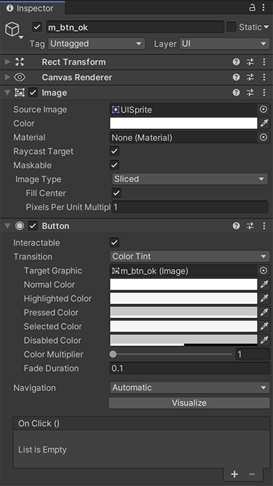
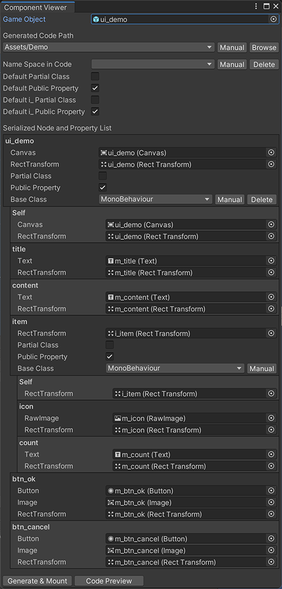

[中文ReadMe文档](./README_CN.md)。

# Description

This tool is designed for GameObject, or prefab, with following features:

- The hierarchy structures of these GameObjects or prefabs are different from each other.
- Accessing and manipulating lots of nodes in hierarchy structure in logic are routine tasks.

Typecal use case : Graphic UI in games.

This tool makes it possible to quickly access the `GameObject` object together with their compnents on a [keynode](#keynode) with the least coding and the least performance cost.

## Primary Capabilies

1. Genrating C# Component for [binding](#binding) or serializing target gameObjects and their components on [keynodes](#keynode) for a GameObject or prefab.
2. Adding the Components in step 1 to the [container](#container) gameObjects automatically.
3. Assigning serialized fields in containers with corresponding gameObjects and their components on [keynodes](#keynode) automatically.
4. Managing instances of template nodes (i.e. [subcontainer](#subcontainer)).

## Glossary

### Container

A container is a collection of [keynodes](#keynode), from which all the gameObjects and their components can be retrieved immediately in your logic code.

Container Component is a Component added to conainer gameObject. It is generated by this tool. It is used for storing references to the gameObjects and their components of [keynodes](#keynode).

All the [keynodes](#keynode) in a container are children nodes of container node in hierarchy structure. a [keynode](#keynode) can only be a member of one container, which refers to the closest container node in its hierarchy parents.

### RootContainer

A RootContainer is a [container](#container) that does not belong to any other [container](#container). The type will have the exact name as its node or gameObject.

### SubContainer

A subcontainer is a [keynode](#keynode) with name starting with "`i_`", and has all features of [container](#container).

The type name will be the string joining of its container type name and its node name without "`i_`" with the saperator '`_`'. For details of type name of sub container component, see [Type Name Of SubContainer Component](#type-name-of-subcontainer-component).

Aub container is also called as template in this tool, because it is often used as a template of repeated visual elements.

### Node

A node is any gameObject of containers and their hierarchy children. All the nodes constitute a tree-structure in hierarchy window.

### KeyNode

A node with its name starts with `"m_"`, `"i_"`, `"o_"` or `"a_"` is called key node.

- A node with its name starts with `"m_"` or `"o_"` is called basic key node. The `GameObject` object and its components will be referenced in its container component. The difference between `"m_"` or `"o_"` is the access right to the corresponding properties outside the container script.
- A node with its name starts with `"i_"` is called [sub container](#subcontainer). It contains all the features of basic key node. A component will be generated and added to sub container's gameObject. And the references to all its key nodes will be automatically assigned and stored in the sub container component.
- A node with its name starts with `"a_"` will be actived via `gameObject.SetActive(true)` when `Open()` method of its container is invoked.

Only a [sub container](#subcontainer) key node may have child node, otherwise the key node will be a leaf.

All non-keynode gameObjects will be ignored by this tool.

The node name without prefix will be acted as property/field name. So it should comply with the rule of property/field name.

In [container](#container) component,  Each key node in [container](#container) corresponds to a member property/field in its [container](#container) component. The member property/field will be a set containing `GameObject`、`Transform`/`RectTransform` of the key node and Components attached.

e.g.

  
  
### NodeComponent

Node component is a component (such as `UnityEngine.UI.Image`, `UnityEngine.UI.Text`) added to a [key node](#keynode). It will be referenced by its container together with its `GameObject` and `Transform`/`RectTransform` objects.

The type of the component should be [registered](#register-component-type) before use. Some frequently-used UGUI Components are already registered inside this tool. You can [register](#register-component-type) the component types you need with lines of code in Editor script to make the referencing to the component available in [container](#container) component.

### ComponentsSet

A components set is a set or collection of `gameObject`, `transform` and components attached to it. It makes it convenient to retrieve more than one object in the set.

The class of component set is defined inside container component class.

The class name of the set will be : `{comp1name}_{comp2name}_..._{compNname}_Set`.

Members of a component set :

- `gameObject` : `GameObject` type, corresponds to `gameObject` of the [key node](#keynode).
- `transform`/`rectTransform` : `Transform`/`RectTransform` type, coressponds to `transform` of the [key node](#keynode). Only one of the two will be existed. It depends on the `transform` is `RectTransform` or not.
- Supported components on the [key node](#keynode) : member name will be the variable name specified when the type is [registered](#register-component-type), member type will be the component type.

For a typical UGUI button node with both `Button` and `Image` attached, the type definition will be :

``` c#
// Snippet from generated container component.
// This class is defined in container component class.
[System.Serializable]
public class RectTransform_Button_Image_Set {

    [SerializeField]
    private GameObject m_GameObject;
    public GameObject gameObject { get { return m_GameObject; } }

    [SerializeField]
    private RectTransform m_rectTransform;
    public RectTransform rectTransform { get { return m_rectTransform; } }

    [SerializeField]
    private Button m_button;
    public Button button { get { return m_button; } }

    [SerializeField]
    private Image m_image;
    public Image image { get { return m_image; } }

}
```

The set a [key node](#keynode) property uses will perfectly match the collection of supported types on the [key node](#keynode).

It is NOT recommanded to declare any variable of component set type.

### Binding

Binding means attaching [key nodes](#keynode) together with their [components](#nodecomponent) to the corresponding serialized fields in [container](#container) components. It also means making the serialized fields in [container](#container) referencing the [key nodes](#keynode) together with their [components](#nodecomponent).

### Hierarchy Structure and Logic Structure

Hierarchy structure is the structure of transforms of nodes or gameObjects shown in Hierarchy window.

Logic structure is the relationship between [root containers](#rootcontainer), basic [key nodes](#keynode) and [sub containers](#subcontainer).

Logic structure is based on and relis on hierarchy structure. If hierarchy modifing of a gameObject or prefab did not involve logic structure changes, the code regenerating and rebinding will make no change.

## Key Features

### Get Root Container Means Get All

- One `GetComponent` invoking can be enough when controlling a `GameObject` with lots of children and complex structures. 
- All the nodes you use are all members of either [root container](#rootcontainer) or [sub container](#subcontainer).

Snippet of a root container component script (generated) :

``` c#
using System.Collections.Generic;
using UnityEngine;
using UnityEngine.Events;
using UnityEngine.UI;

public class ui_demo : MonoBehaviour {

    [SerializeField]
    private RectTransform_Canvas_Set m_Self;
    public RectTransform_Canvas_Set Self { get { return m_Self; } }

    [SerializeField]
    private RectTransform_Text_Set m_title;
    public RectTransform_Text_Set title { get { return m_title; } }

    [SerializeField]
    private RectTransform_Text_Set m_content;
    public RectTransform_Text_Set content { get { return m_content; } }

    [SerializeField]
    private RectTransform_ui_demo_item_Set m_item;
    public RectTransform_ui_demo_item_Set item { get { return m_item; } }

    [SerializeField]
    private RectTransform_Button_Image_Set m_btn_ok;
    public RectTransform_Button_Image_Set btn_ok { get { return m_btn_ok; } }

    [SerializeField]
    private RectTransform_Button_Image_Set m_btn_cancel;
    public RectTransform_Button_Image_Set btn_cancel { get { return m_btn_cancel; } }

    public void Open() {
        m_item.item?.Open();
    }

    private UnityEvent mOnClear;
    public UnityEvent onClear {
        get {
            if (mOnClear == null) { mOnClear = new UnityEvent(); }
            return mOnClear;
        }
    }

    public void Clear() {
        m_item.CacheAll();
        m_btn_ok.button?.onClick.RemoveAllListeners();
        m_btn_cancel.button?.onClick.RemoveAllListeners();
        if (mOnClear != null) { mOnClear.Invoke(); mOnClear.RemoveAllListeners(); }
    }

    [System.Serializable]
    public class RectTransform_Button_Image_Set { ... }

    [System.Serializable]
    public class RectTransform_Canvas_Set { ... }

    [System.Serializable]
    public class RectTransform_Text_Set { ... }

    [System.Serializable]
    public class RectTransform_ui_demo_item_Set { ... }

}
```

### Quick Access to All You Need on a Node

- You may want to retrieve `gameObject` and more than one components (such as `RectTransform`,`Button`or`Image`) from one [node](#keynode).
- Each [node](#keynode) corresponds to a [set](#componentsset) in [container](#container). The [set](#componentsset) consists of `GameObject`, `Transform`/`RectTransform` and its [components](#nodecomponent) on the [node](#keynode).
- The members in the [set](#componentsset) are fields, the name of which was specified based on the rules during [component type registering](#register-component-type).

Demo components on a typical UGUI button :

  

See [Components Set](#componentsset) for type definition for the set.

### Instances Management of SubContainer

- [Sub containers](#subcontainer) can be used as templates to create multi instances.
- Instance managenet APIs are demonstrated in generated code. The APIs are member methods of [sub container](#subcontainer) node in its [container](#container).

For demo, see [Instances of SubContainer](#instances-of-subContainer).

### GameObject Recycling and Reusing

- `Open()` and `Clear()` methods will be generated in each [container](#container) component type. `Open()` method is used to invoke all `Open()`  methods in every [component](#nodecomponent) if exist. `Clear()` method is used to clear `UnityEvent` in all [key nodes](#keynode), and invoke `Clear()` methods in every [component](#nodecomponent) if exist.
- It's required to invoke `Clear()` method of [root container](#rootcontainer) before recycling a `GameObject` instance.
- An event named `onClear` will be declared in each [container](#container) component. It will be invoked when the [container](#container) is being recycled, i.e. `Clear()` is invoked, to help clearing your logic associated to the [container](#container) instance.

### Node Array and Array Field

- References to more than one [key nodes](#keynode) can be stored in one array typed serialized field of a [container](#container).
- The array elements nodes can be sorted by default rules and be sorted manually.
- All kinds of [key nodes](#keynode) works with node array.

  

# Rules in Detail

## Naming Key Nodes

- The [node](#node) you specified when operating this tool window will be [root container](#rootcontainer) node. Its name should comply with the rule of class name.
- For basic [key node](#keynode), the node name without prefix should comply with the rule of variable name.
- For [sub container](#subcontainer) node, the node name without prefix should comply with both the rule of class name and the rule of variable name, because its name will act as a varialbe name and be part of type name of [sub container](#subcontainer) component. See [Type Name Of SubContainer Component](#type-name-of-subcontainer-component) for more detail about type name of [sub container](#subcontainer) component.

## Type Name of RootContainer Component

- [Root container](#rootcontainer) component have the exact name as its root node name.

## Type Name Of SubContainer Component

### Default Name Rule

The default name of generated [sub container](#subcontainer) component is : `{name_of_its_container}_{name_of_Sub_container_node_without_prefix}`.

### Custom Surfix

The name of [sub container](#subcontainer) node should match the format : `i_{node_var_name}|{type_name_surfix}`. The character `'|'` splits the node name and type name surfix.

When using this rule, the name of generated [sub container](#subcontainer) component type is : `{parent_container_type}_{type_name_surfix}`.

### Fully Customized

The name of [sub container](#subcontainer) node should match the format : `i_{node_var_name}||{full_name_of_sub_container_type}`. The two characters `"||"` split the node name and full name of [sub container].

When using this rule, the name of generated [sub container](#subcontainer) component type is : `{full_name_of_sub_container_type}`.

## Naming Node in Array

- A [key node](#keynode) with its name ends with surfix `"[]"` or `"[$index]"`(index is an unsigned integer) will be an array element .
- The name of serialized array field will be the node name without prefix and surfix.
- If index is specified, the [key node](#keynode) will be the element at the index. The [key nodes](#keynode) without index will be sorted as the order in hierarchy and fill the emtry indices.

## Using 'partial class' and 'public property'


The following settings can be used in customizing the class definition of every [root container](#rootcontainer) and [sub container](#subcontainer) :

- Whether to use "partial" key word for [container](#container) component class : It's used for customizing [container](#container) component class.
- Whether to define nodes as "public property" : It's used for protect serialized fields from being modified.

The default value of the settings above can be modified.

Unchecking "public property" is recommended if the [container](#container) and its logic are "partial class". Unchecking "partial class" and checking "public property" is recommended if the [container](#container) is only used for serializing and [binding](#binding).

## 'Self' Property in Container Component

- The [container](#container) node is also a [key node](#keynode) in itself.
- 'Self' property is used for retrieving the [components set](#componentsset) of the [container](#container) node itself.

'Self' property may be used in following cases :

- `Canvas` component on root of UGUI window is required.
- `Button` component on `i_ListItem` instance is required.

## Rules of Ignoring KeyNodes

In some cases, you may not want some [nodes](#node) to be members in a [container](#container), even their name attempt to them [key nodes](#keynode). e.g.

- Some other logic requires a [node](#node) with a specific name which meets the rule of [key node](#keynode) name, but the [node](#node) should not be a [key node](#keynode).
- Using nested prefab feature, "prefab A" is a child [key node](#keynode) in "prefab B" with a proper [node](#node) name. "Prefab A" has already been a [container](#container) with [container](#container) component attached to it, and the type of the [container](#container) is already [registered](#register-component-type). So [key nodes](#keynode) in "prefab A" should no longer be members of any [container](#container) in "prefab B".

### Ignore Children with Node Name Prefix

If a [node](#node) with its name starts with `~`, the children of this [node](#node) will not belong to any [container](#container).

If a [node](#node) with its name starts with `~` and followed by a proper [key node](#keynode) name, it will still be a [key node](#keynode).

### Ignore Children of Node Containing Custom Component

During [registering custom component type](#register-component-type), `SetAbortChild(true)` of the returned value should be invoked before returning.

``` c#
[SupportedComponentType]
static SupportedTypeData DefineTypeMyComponent() {
    return new SupportedTypeData(typeof(MyComponent), 1000)
        // Invoke this method to ignore children of 'MyComponent' node.
        // SetAbortChild method returns 'this'。
        .SetAbortChild(true);
}
```

## The Path of Generated Codes

Each `GameObject` object or prefab corresponds to its own folder storing the generated codes. But this tool does not save the correspondence.

When the tool window opens a `GameObject` object or a prefab, this tool will find the codes that match the most, and the folder of the codes will be the target folder when generate the codes again. The customize settings of [container](#container) component class is retrieved when finding the codes.

## Instances of SubContainer

- Each property object of a [sub container](#subcontainer)(aka template) in its [container](#container) has three methods(`GetInstance()`，`CacheInstance()`and`CacheAll()`). They are used to get an instance of the template, recycle single template instance and recycle all instances in use.
- For the template instance returned by `GetInstance()` method, the properties of its transform will keeps the same as that of template, and the node is right behind the template in hierarchy window, which means the `siblingIndex` value of the instance is one greater than that of template.
- It is recommended to create a visible list using `GetInstance()` method in a reversed traversal together with a Layout component.

``` c#
private YourUI mUI;
void ListDemo() {
    // Deactive the template node.
    mUI.listItem.gameObject.SetActive(false);
    List<SomeData> datas = GetSomeDatas();
    // listItem is a sub container (template) in YourUI.
    // Clear the list and recycle all instances before recreating.
    mUI.listItem.CacheAll();
    // Traverse the data in reverse order.
    // The latter created instance will be on top of the previous.
    for (int i = datas.Count - 1; i >= 0; i--) {
        SomeData data = datas[i];
        var item = mUI.listItem.GetInstance();
        // Manually activate the node is required.
        item.Self.gameObject.SetActive(true);
        // 获取someTextNode节点中的Text组件
        Text textComp = item.someTextNode.text;
        textComp.text = data.someText;
        // Something to dispose when the instance is no longer used.
        IDisposable disposable = DoSomeBind(item.someNode.someComponent, data.someProperty);
        // The event onClear will be invoked when the instance is being recycled.
        // It may triggered by mUI.Clear(), mUI.listItem.CacheAll(), ...
        // It's used to release your logic associated with the instance.
        item.onClear.AddListener(() => {
            disposable.Dispose();
        });
    }
}
// Invoked when UI is closed
void OnClose() {
    // When this method is invoked, all the Clear method in its sub container and components will be invoked if exist.
    // When cleared, the mUI component and its gameObject are ready for reusing.
    mUI.Clear();
}
```

# Quick Start

## Add or Update Container Component for GameObject

1. Prepare your gameObject or prefab, arrange the logical hierarchy with [key nodes](#keynode) and [sub containers](#subcontainer), and name them.

   
2. Right click on target prefab in 'Project' window and select "GreatClock > Open Binding Tool" to open the operating window. Or open the menu "GreatClock > Open Binding Tool" to open the operating window, and drag your gameObject or prefab to the "Game Object" box in the window.

   
   
   

3. Check and modify the target folder to store codes and namespace the code uses.
4. Check the [key nodes](#keynode) and their [components](#nodecomponent) in the window.
5. Check the base class, "partial class" and "public property" settings of all [containers](#container).
6. Click "Generate & Mount" button. By doing this, this tool will generate or update codes for [containers](#container), and assign all the serialized field with proper value after compiling. After this step, the inspector window will be shown as followings when the prefab is selected:

   

7. Manipulate the [key nodes](#keynode) and their [components](#nodecomponent) by either partial class or retrieving [root container](#rootcontainer) component. Demo codes for manipulating instance of "ui_demo.prefab" :

``` c#
private ui_demo mUI;
void OnLoaded(GameObject go) {
    ui_demo mUI = go.GetComponent<ui_demo>();
    // Register click callback for the two buttons.
    mUI.btn_ok.button.AddListener(OnClickOK);
    mUI.btn_cancel.button.AddListener(OnClickCancel);
    // 'item' node serves as a template. It's not a visual element.
    mUI.item.gameObject.SetActive(false);
    // Invoke Open method of root container to start the logic in all sub container and components.
    mUI.Open();
    mUI.title.text.text = "Title";
    mUI.content.text.text = "Content content ...";
    for (int i = 0; i < 3; i++) {
        var item = mUI.item.GetInstance();
        item.Self.gameObject.SetActive(true);
        // populate item.icon and item.count with proper content.
        item.icon.image.sprite = GetSprite();
        item.count.text.text = GetCountText();
    }
}
void OnClose() {
    if (mUI != null) {
        // Invoke Clear method to recycle all template instances in use.
        // It will also invoke all Clear methods in sub container and components.
        // Thus the gameObject and container will be ready for reusing.
        mUI.Clear();
        mUI = null;
    }
}
private void OnClickOK() { }
private void OnClickCancel() { }
  ```

## Register Component Type

The following snippet of Editor code will make this tool works with specific component.

``` c#
using GreatClock.Common.SerializeTools;

// This class should run in Unity Editor. The class name dose NOT matter.
public class SerializeToolExtend {
    
    // The attribute is neccessary. Method should be static and returns instance of 'SupportedTypeData' containing customized properties.
    // The method shoud have no arguments.
    // The method name should just meet the needs of reading and code managing.
    [SupportedComponentType]
    static SupportedTypeData DefineTypeMyComponent() {
        // Specify the type of component and is sorting order
        return new SupportedTypeData(typeof(MyComponent), 1000);
    }
    
    [SupportedComponentType]
    static SupportedTypeData DefineTypeTween() {
        // Make this tool works with 'MyTweenComponent'.
        // And name the field name to 'tween' in components set.
        return new SupportedTypeData(typeof(MyTweenComponent), 1000)
            .SetVariableName("tween");
    }
    
}
```

### Override Registered Component Types in This Tool

Some most frequently used components are registered in `SerializedComponentWindow.cs`, such as `Transform`, `RectTransform`, `Canvas`, `Image` and some other UGUI components. These components work with this tool natively.

You may re-register these components to change the customization of them as described above. If a internal registered component is re-registered external, the internal registation will be ignored.

### Properties of SupportedTypeData

| Property Name        | Type   | Assignment              | Default Value | Description                                                                                                                                      |
| -------------------- | ------ | ----------------------- | ------------- | ------------------------------------------------------------------------------------------------------------------------------------------------ |
| `type`               | Type   | Constructor             | -             | The type of target component. The type should be sub class of `Component` and should not be null.                                                |
| `priority`           | int    | Constructor             | -             | It's used to order the components. The smaller one comes earlier.                                                                                |
| `showName`           | string | `SetShowName`           | null          | The name for show when previewing in the operating window. Component type name will be used if null.                                             |
| `nameSpace`          | string | `SetNameSpace`          | null          | Works with `codeTypeName` to manually customize the type name and the using namespace used in generated code.                                    |
| `codeTypeName`       | string | `SetCodeTypeName`       | null          | Works with `nameSpace` to manually customize the type name and the using namespace used in generated code.                                       |
| `variableName`       | string | `SetVariableName`       | null          | The field name of the component in [components set](#componentsset). Lower camel case of the component name will be used if null.                |
| `clearEventsOnClear` | bool   | `SetClearEventsOnClear` | true          | Whether to invoke `RemoveAllListeners` of `UnityEvent` in component (such as `onClick` in `Button`) when `Clear` method of container is invoked. |
| `abortChild`         | bool   | `SetAbortChild`         | false         | Whether to ignore all children of the node that this component is attached.                                                                      |

# Attentions

- The generated code is NOT worth reading, and should NOT be edited manually.
- Duplicated name of [key nodes](#keynode) is not allowed except for array element nodes.
- The name of [key node](#keynode) should not be any of C# key words or property names used in `MonoBehaviour`.
- This tool will only ADD or UPDATE the [root container](#rootcontainer) and [sub containers](#subcontainer) component according the current hierarchy tree, and do NOTHING with [containers](#container) that are no longer exist in new logic structure. Moving, renaming [sub container](#subcontainer) node and make it a none-container node will make a [container](#container) component no longer valid. These invalid [containers](#container) should be removed manually.
- It brings both convenience and troubles to retrieve [key nodes](#keynode) and their [components](#nodecomponent) by reading member fields. Compile errors may occur after hierarchy changes. On the other hand, this compile error illustrates the mismatch of your logic code and your asset.

# Trouble Shootings and Tricks

## Compile Error after Code Generation

The following operations may bring compile errors after the generation of [root container](#rootcontainer) or [sub container](#subcontainer) components. Solutions are also listed :

- Illegal name for [key node](#keynode) or [sub container](#subcontainer) : Make the name a valid variable or class name.
- [Key node](#keynode) is deleted but the field of [container](#container) component is still referenced : Restore the [key node](#keynode) or delete the logic referencing to the invalid field.
- [Key node](#keynode) is renamed but the logic is still referencing the invalid field of [container](#container) component : Change the invalid field name into the new field name.
- [Component](#nodecomponent) on [key node](#keynode) is removed but the logic is still referencing the comonent : Restore the component or delete the logic referencing to the missing component field.

Note : The [binding](#binding) process can work properly only when there's no compile error. So a re-bind process is required after fixing the comile errors.

## Using One Component Type for Multi SubContainers with Same Structure


Using rules : [Custom Surfix](#custom-surfix) or [Fully Costomized](#fully-customized) in [Type Name Of SubContainer Component](#type-name-of-subcontainer-component).

Notes :

- All [sub container](#subcontainer) nodes should correspond to a same [container](#container) component type.
- The members of [sub container](#subcontainer) component are the union set of all [key nodes](#keynode) in these [sub container](#subcontainer) nodes. The [components set](#componentsset) is also the union set of all [components](#nodecomponent) on the [nodes](#keynode) with the same name.
- It's recommended to keep the hierarchy structure of the [sub container](#subcontainer) nodes consistent.
- If a field in [sub container](#subcontainer) component does not correspond to any [key nodes](#keynode) in the [sub container](#subcontainer), the field, aka [components set](#componentsset) object, will not be `null`. But the value of all its serialized fields will be `null`.
- If a member listed in its [components set](#componentsset) does not correspond to any [components](#nodecomponent) attached to a [key node](#keynode), the value of the [components set](#componentsset) member of this [key node](#keynode) will be `null`.

e.g. A demand for a podium :

- Different stage height and style for champion, 2nd-winner and 3rd-winner, which is demonstrated by different gameObjects in a prefab.
- The three stages should show each winners' name, nation and score with different style.
- An empty node is required in each stage for placing the player's model for show.
- Three root nodes for the three stages, and the order would be 2rd-winner, champion and 3rd-winner.
- The three stages are of the same component type, and listed in an array sized 3, and the order of the stages should be champion, 2nd-winner and 3rd-winner.

The hierarchy structure below will meets the needs :


Code snippet from generated code for podium.prefab :

``` c#
// podium.cs
public class podium : MonoBehaviour {
    ...
    [SerializeField]
    private RectTransform_podium_stage_Set[] m_stages;
    public RectTransform_podium_stage_Set[] stages { get { return m_stages; } }
    ...
}

// podium_stage.cs
public class podium_stage : MonoBehaviour {

    [SerializeField]
    private RectTransform_Set m_Self;
    public RectTransform_Set Self { get { return m_Self; } }

    [SerializeField]
    private RectTransform_Text_Set m_player_name;
    public RectTransform_Text_Set player_name { get { return m_player_name; } }

    [SerializeField]
    private RectTransform_Text_Set m_player_nationality;
    public RectTransform_Text_Set player_nationality { get { return m_player_nationality; } }

    [SerializeField]
    private RectTransform_Text_Set m_player_score;
    public RectTransform_Text_Set player_score { get { return m_player_score; } }

    [SerializeField]
    private RectTransform_Set m_player_model_root;
       public RectTransform_Set player_model_root { get { return m_player_model_root; } }

    ...
}
```