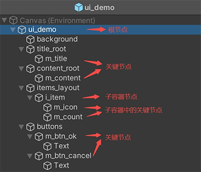
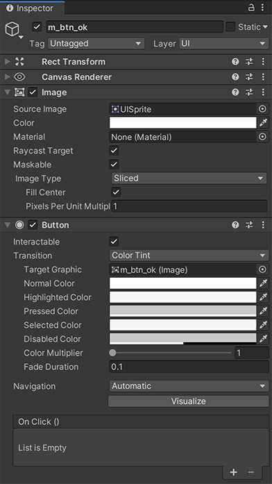
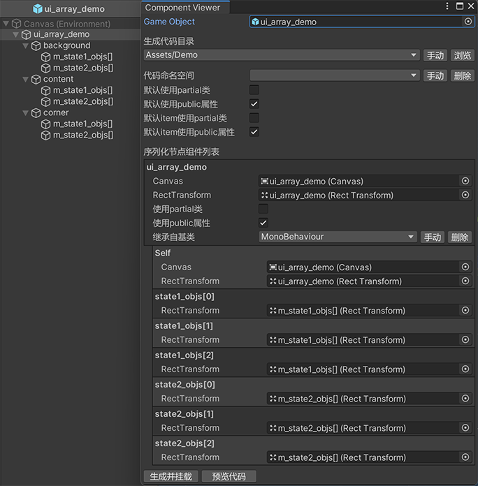
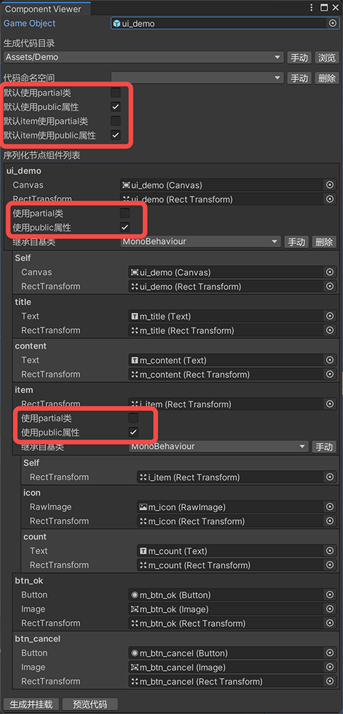
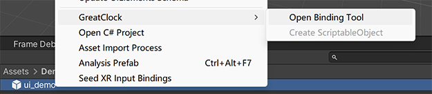
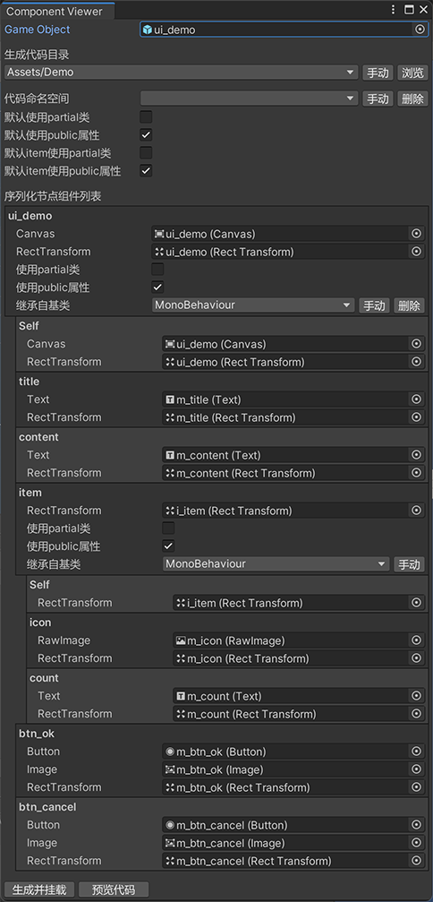
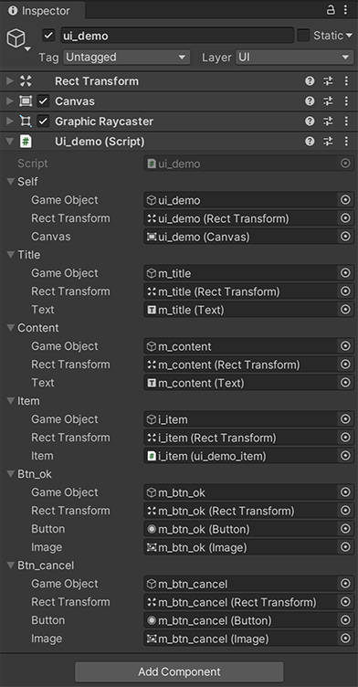
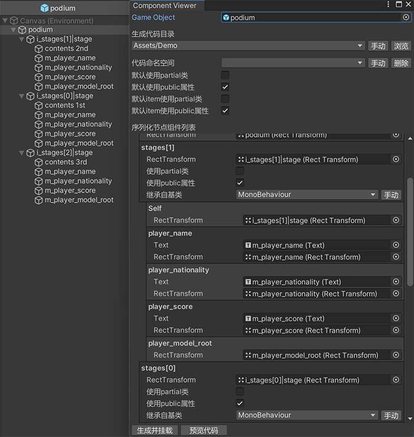

[README in English](./README.md).

# 概述

此工具专为对于有以下特点的GameObject（或prefab）而设计：

- [节点](#节点)结构各不相同；
- 对其中的大量[节点](#节点)及其组件有较多操作。

典型使用场景：游戏UI界面。

此工具旨在让开发者在操作上述GameObject时，能够以最少代码量且最少性能开销的方式，快速访问到GameObject中需要的[关键节点](#关键节点)的GameObject对象及其组件。

## 核心功能

1.  为GameObject或prefab生成定制的用于[绑定](#绑定)变量与目标[关键节点](#关键节点)及其组件的代码。
2. 自动向[容器](#容器)节点上挂载步骤1中生成的组件， 无需任何手动拖拽以进行关联操作。
3. 自动关联上述组件中的序列化属性与其对应的[关键节点](#关键节点)及其[组件](#节点组件)。
4. 模板节点（[子容器](#子容器)）的实例管理。

## 名词解释

### 容器

容器是所有[关键节点](#关键节点)的集合，逻辑代码中可以通过容器快速获取到其中的[关键节点](#关键节点)及其组件。

容器组件是挂在容器节点上的一个组件（Component），其代码由此工具生成。该组件用于存储对于该容器中所有[关键节点](#关键节点)及其组件的引用。

容器内包含的[关键节点](#关键节点)均为容器所在节点的子节点。一个[关键节点](#关键节点)只会属于一个容器，对应其父节点中离它最近的容器节点。

### 根容器

其容器本身不再属于其他容器，其组件类型名称与容器本身节点的名称相同。

### 子容器

名称以`"i_"`开头的[关键节点](#关键节点)，它将包含[容器](#容器)的所有特性。

子容器组件的类型名默认为其所在父容器的类型名称与节点名称去掉`"i_"`的部分的组合，并以下划线分隔，详见[子容器节点组件名称的规则](#子容器节点组件名称的规则)。

子容器通常用于定义展示内容中重复元素的模板，所以本工具中也称子容器为模板。

### 节点

即容器节点及其下所有的GameObject对象，所有节点可组成树状的层级结构。

### 关键节点

容器的子节点中，名称以`"m_"`、`"i_"`、`"o_"`或`"a_"`前缀开头的[节点](#节点)为关键节点。

- 以`"m_"`或`"o_"`开头的节点是普通关键节点，关键节点及其组件将被该节点所在的容器引用，二者差异为外部访问代码中相应序列化属性的权限差异；
- 以`"i_"`开头的节点为[子容器](#子容器)节点，除包含所有普通关键的特性外，此工具还将在此节点上为其挂载容器组件，用于存储对该容器节点下所有关键节点及其[节点组件](#节点组件)的引用。
- 以`"a_"`开头的关键节点，仅用于标记该节点需要在逻辑启动时激活。

非[子容器](#子容器)的关键节点在树形结构中为叶子节点，其不会再有子节点。

非关键节点在本工具插件中将被完全忽略。

关键节点名称除前缀以外的部分将被用作字段名称或属性名称，所以节点名称除前缀以外的部分应满足变量的命名规则。

在[容器](#容器)组件中，每个关键节点对应一个成员变量，这个变量是其`GameObject`、`Transform`/`RectTransform`与节点上其他所有支持的组件的[集合](#组件集合)。

示例：

  
  
### 节点组件

逻辑功能开发时挂载于[关键节点](#关键节点)上的功能组件，如`UnityEngine.UI.Image`、`UnityEngine.UI.Text`等，将与节点的`GameObject`、`Transform`/`RectTransform`对象一起被其所在的容器引用。

组件类型需要被[注册](#为此工具增加其他类型组件的支持)后组件才会被引用，此工具内已经实现了部分组件的注册。您可根据需求，通过编写少量代码将所需组件的类型进行[注册](#为此工具增加其他类型组件的支持)，以使该类型的组件会被[容器](#容器)组件引用。

### 组件集合

为方便同时操作某一节点上`gameObject`、`transform`以及该节点上一个或多个组件，引入组件集合的概念，关键节点上的上述对象都是此集合中的元素。

组件集合在生成的代码中，表现为内部类。

其类名规则：`{组件1名称}_{组件2名称}_..._{组件N名称}_Set`。

其成员包括：

- `gameObject`：`GameObject`类型，对应该[节点](#关键节点)的`gameObject`对象。
- `transform`/`rectTransform`：`Transform`/`RectTransform`类型，对应该节点的`transform`对象。二者只会存在一个，取决于该`transform`是否为`RectTransform`。
- [节点](#关键节点)上所有受支持的组件：成员名称为[注册组件支持]时为该组件确定好的变量名称，成员类型即为组件的类型。

一个典型的UGUI按钮节点（同时挂有`Button`和`Image`两个组件）对应的集合类定义如下：

``` c#
// 此代码段源自生成的容器代码，并作为其中的内部类。
[System.Serializable]
public class RectTransform_Button_Image_Set {

    [SerializeField]
    private GameObject m_GameObject;
    public GameObject gameObject { get { return m_GameObject; } }

    [SerializeField]
    private RectTransform m_rectTransform;
    public RectTransform rectTransform { get { return m_rectTransform; } }

    [SerializeField]
    private Button m_button;
    public Button button { get { return m_button; } }

    [SerializeField]
    private Image m_image;
    public Image image { get { return m_image; } }

}
```

每个[关键节点](#关键节点)都会使用与之匹配的集合，这个集合只包含该节点上挂有的受支持的组件。

推荐尽量不要在逻辑代码中声明该组件集合类型的变量。

### 绑定

将[容器](#容器)C#组件中的序列化属性与对应的[关键节点](#关键节点)和[节点组件](#节点组件)进行关联，即在编辑器中为[容器](#容器)组件中的序列化属性相应的赋值。

### 节点结构与逻辑结构

节点结构即为Prefab或GameObject对象及其所有子节点在Hierarchy窗口中展示的结构。

逻辑结构为[根容器](#根容器)、普通[关键节点](#关键节点)及[子容器](#子容器)之间的树形结构。

节点结构是逻辑结构的基础，也是划分逻辑结构的依据。在此方案中，在修改节点结构时，如果没有涉及逻辑结构的改变，则重新生成代码并进行重新绑定的操作不会产生任何变更。

## 特性

### 获取到根容器后即可访问到全部关键节点及其组件

- 对一个有众多子节点且结构复杂的`GameObject`对象进行操作的过程中，理论上仅需要调用一次`GetComponent`即可。
- 逻辑中所需要用到的节点，都对应[根容器](#根容器)或[子容器](#子容器)组件中的同名成员属性。

生成的根容器代码节选：

``` c#
using System.Collections.Generic;
using UnityEngine;
using UnityEngine.Events;
using UnityEngine.UI;

public class ui_demo : MonoBehaviour {

    [SerializeField]
    private RectTransform_Canvas_Set m_Self;
    public RectTransform_Canvas_Set Self { get { return m_Self; } }

    [SerializeField]
    private RectTransform_Text_Set m_title;
    public RectTransform_Text_Set title { get { return m_title; } }

    [SerializeField]
    private RectTransform_Text_Set m_content;
    public RectTransform_Text_Set content { get { return m_content; } }

    [SerializeField]
    private RectTransform_ui_demo_item_Set m_item;
    public RectTransform_ui_demo_item_Set item { get { return m_item; } }

    [SerializeField]
    private RectTransform_Button_Image_Set m_btn_ok;
    public RectTransform_Button_Image_Set btn_ok { get { return m_btn_ok; } }

    [SerializeField]
    private RectTransform_Button_Image_Set m_btn_cancel;
    public RectTransform_Button_Image_Set btn_cancel { get { return m_btn_cancel; } }

    public void Open() {
        m_item.item?.Open();
    }

    private UnityEvent mOnClear;
    public UnityEvent onClear {
        get {
            if (mOnClear == null) { mOnClear = new UnityEvent(); }
            return mOnClear;
        }
    }

    public void Clear() {
        m_item.CacheAll();
        m_btn_ok.button?.onClick.RemoveAllListeners();
        m_btn_cancel.button?.onClick.RemoveAllListeners();
        if (mOnClear != null) { mOnClear.Invoke(); mOnClear.RemoveAllListeners(); }
    }

    [System.Serializable]
    public class RectTransform_Button_Image_Set { ... }

    [System.Serializable]
    public class RectTransform_Canvas_Set { ... }

    [System.Serializable]
    public class RectTransform_Text_Set { ... }

    [System.Serializable]
    public class RectTransform_ui_demo_item_Set { ... }

}
```

###  可快速获取一个节点上的多个组件

- 业务逻辑中可能会用到同一个[节点](#关键节点)上的`gameObject`以及一个多个`Component`，例如`RectTransform`、`Button`和`Image`。
- 在生成的代码中，每一个[节点](#关键节点)都对应着一个[组件集合](#组件集合)，这个集合中包含了`GameObject`、`Transform/RectTransform`以及其他`Component`对象。
- [集合](#组件集合)中的`GameObject`、`Transform/RectTransform`以及其他`Component`对象都是这个[集合](#组件集合)类型中的成员变量，具体组件对应的变量名称根据[规则](#为此工具增加其他类型组件的支持)预先设定。

一个典型UGUI按钮节点上的组件示例：

  

其集合类定义见[组件集合](#组件集合)中的示例代码。

### 子容器节点的实例管理

- [子容器](#子容器)节点可以作为模板节点使用，以按需创建多个实例。
- 生成的代码中提供了创建和回收及清理模板节点实例的方法，这些方法属于其所在[容器](#容器)的[子容器](#子容器)节点。

使用示例可参考文档中[关于模板实例](#关于模板实例)。

### 方便回收重用

- 所有生成的[容器](#容器)组件都包含`Open()`与`Clear()`方法。其中`Open()`方法用于调起容器中所有关键节点上带有`Open()`方法的组件，`Clear()`方法用于清理所有[关键节点](#关键节点)组件的`UnityEvent`事件、回收所有[子容器](#子容器)实例。
- 当资源实例需要被回收时，调用[根容器](#根容器)的`Clear()`方法即可。
- 所有[容器](#容器)组件都定义有`onClear`事件，当[容器](#容器)被回收（调用容器的`Clear()`方法）时，会委派此事件，帮助对[容器](#容器)实例关联的逻辑进行及时清理。

### 支持节点对象数组

- 多个[关键节点](#关键节点)可以被关联到[容器](#容器)中同一个数组类型的成员变量中。
- 同个数组中的关键节点支持默认规则排序和自定义排序。
- 所有类型的[关键节点](#关键节点)均支持节点对象数组。

  

# 规则详述

## 关键节点命名规则

- 在使用此工具界面时指定的根节点为[根容器](#根容器)节点，它的名称应满足类型命名规则。
- 对于普通[关键节点](#关键节点)，节点名称中除前缀以外的部分应满足变量的命名规则。
- 对于[子容器](#子容器)节点，由于[子容器](#子容器)节点是其所在[容器](#容器)节点的一个节点，所以其[节点](#关键节点)名称中除前缀以外的部分应满足变量的命名规则；同时由于[子容器](#子容器)必须对应一个生成的[子容器](#子容器)组件，所以其名称也会被用于指定该组件的名称。[子容器](#子容器)组件名称的[详细规则与特殊规则](#子容器组件类型名称的规则)见下文。

## 根容器组件类型名称的规则

- [根容器](#根容器)组件的类型名称与根节点名称相同。

## 子容器组件类型名称的规则

### 默认规则

默认生成的[子容器](#子容器)组件名称为：`{所在容器的组件名称}_{子容器节点名称除i_以外的部分}`。

### 自定义后缀

使用此规则时，[子容器](#子容器)节点的名称规则为：`i_{变量名称}|{组件类型名后缀}`。此节点名称中以单竖线`'|'`将“变量名称”与“组件类型名后缀”分隔。

此时，生成的[子容器](#子容器)组件名称为：`{所在容器的组件名称}_{组件类型名后缀}`。

### 完全自定义

使用此规则时，[子容器](#子容器)节点的名称规则为：`i_{变量名称}||{组件类型全名}`。此节点名称中以双竖线`"||"`将“变量名称”与“组件类型全名”分隔。

此时，生成的[子容器](#子容器)组件名称为：`{组件类型全名}`。

## 数组元素节点及命名规则

- [关键节点](#关键节点)的名称以`[]`或`[$index]`（其中index为自然数）后缀结尾的，认为该节点位于数组中。
- 容器中数组变量的名称不包含`[]`部分。
- 数组中[关键节点](#关键节点)的顺序，默认按节点结构从上到下排序；若某个节点名称后的中括号中指定了索引，则该节点必占据指定索引的位置，其余未指定索引的节点在数组中的其余位置按默认规则排序。

## 使用partial类和public属性



可以为对每个[根容器](#根容器)和[子容器](#子容器)组件类进行如下定制：

- 是否将[容器](#容器)组件类为partial类，此设定用于对[容器](#容器)组件类进行自定义扩展。
- 是否使用"public property"的方式定义节点属性，此设定用于保护序列化属性不被修改。

以上定制均可以设置全局默认值。

若使用"partial类"方式将逻辑写在[容器](#容器)组件的同个类中，建议用private属性；若仅使其发挥[容器](#容器)（序列化和[绑定](#绑定)）的作用，建议使用非partial类与public属性。

## 关于生成代码中容器类型的Self属性

- [容器](#容器)节点自身也会被作为此容器内部的一个[关键节点](#关键节点)。
- Self属性用于获取[容器](#容器)节点自身上所挂的[组件集合](#组件集合)。

在以下情况下，可能会用到Self属性：

- 需要使用UGUI界面根节点的`Canvas`组件。
- 获取`i_ListItem`列表元素实例节点上的`Button`组件。

## 忽略子节点规则

在某些特殊情况下，即使某些[节点](#节点)的名称满足[关键节点](#关键节点)的命名规则，但你可能不希望这些[节点](#节点)出现在[容器](#容器)之中，例如：

- 其他代码的特殊规则要求[节点](#节点)的命名恰好满足[关键节点](#关键节点)的命名规则，但不希望该[节点](#节点)成为此工具中的[关键节点](#关键节点)。
- 通过prefab B通过prefab嵌套的方式将prefab A作为其中的子节点，并以上述的命名方式将其为[关键节点](#关键节点)，但prefab A中的核心组件已经是通过此工具生成过代码的[根容器](#根容器)了，此时不希望prefab A中的关键节点出现在prefab B的[容器](#容器)中。

### 通过节点名称前缀忽略子节点

[节点](#节点)名称以`~`开头时，该[节点](#节点)的所有子节点不会属于任何[容器](#容器)。

但以`~`开头的[节点](#节点)，如果名称的其余部分仍满足[关键节点](#关键节点)的命名规则，由它会被当作正常的[关键节点](#关键节点)进行处理。

### 忽略自定义组件节点下的子节点

需要在使用[为此工具增加其他类型组件的支持](#为此工具增加其他类型组件的支持)规则进行注册自定义类型的代码中，在函数返回结果之前，调用其`SetAbortChild(true)`方法。

``` c#
[SupportedComponentType]
static SupportedTypeData DefineTypeMyComponent() {
    return new SupportedTypeData(typeof(MyComponent), 1000)
        // 调用此方法，用于忽略该组件所在节点的所有子节点。
        // 此方法返回this，所以代码可简写为链式形式。
        .SetAbortChild(true);
}
```

## 生成代码的存储路径

对于每一个`GameObject`对象或prefab资源都可以独立指定存放其生成代码的文件夹，但此工具中并没有存储此二者之间的对应关系。

在此工具的操作打开一个`GameObject`对象或prefab时，此工具会自动在工程中查找与之匹配代码，并将此路径作为下一次生成代码时的目标文件夹。同时，将此对象中所有容器类型的基类、partial类和public属性相关的配置一并从代码中读取。

## 关于模板实例

- 每个[子容器节点](#子容器)（模板）在其[容器](#容器)中对应的属性对象，都包含`GetInstance()`、`CacheInstance()`和`CacheAll()`三个方法，分别用于获取单个实例、回收单个实例和回收所有未被回收的实例。
- 每次通过`GetInstance()`方法获取到的模板实例，Transform的属性均与模板节点的Transform属性相同，且新的实例节点在Hierarchy窗口中将位于模板节点的下方且紧挨模板节点，即其`siblingIndex`刚好比模板节点的`siblingIndex`大1。
- 推荐使用Layout组件，并在代码中逆序遍历数据，配合`GetInstance()`方法创建列表。

``` c#
private YourUI mUI;
void ListDemo() {
    // 取消激活模板节点。
    mUI.listItem.gameObject.SetActive(false);
    List<SomeData> datas = GetSomeDatas();
    // listItem为YourUI中的模板节点（子容器节点）。
    // 创建节点实例前先将列表清空，将之前使用的所有节点回收。
    mUI.listItem.CacheAll();
    // 逆序遍历数据。
    // 第N+1次创建的节点，将位于第N次创建的节点之前。
    for (int i = datas.Count - 1; i >= 0; i--) {
        SomeData data = datas[i];
        var item = mUI.listItem.GetInstance();
        // 需要手动激活节点。
        item.Self.gameObject.SetActive(true);
        // 获取someTextNode节点中的Text组件。
        Text textComp = item.someTextNode.text;
        textComp.text = data.someText;
        // 需要在此模板实例实例（item）被回收时，附带回收（注销）的对象，可这样操作。
        IDisposable disposable = DoSomeBind(item.someNode.someComponent, data.someProperty);
        // item的onClear事件，将在调用mUI.Clear()、mUI.listItem.CacheAll()等回收方法时触发，用于释放（注销）与此模板实例的绑定关系。
        item.onClear.AddListener(() => {
            disposable.Dispose();
        });
    }
}
// 界面关闭回调入口
void OnClose() {
    // 调用此方法后，mUI容器中所有的关键节点及其组件都将调用其Clear方法。
    // 此后，mUI所在的gameObject将处于等待回收重用的状态。
    mUI.Clear();
}
```

# 操作步骤

## 为GameObject新增或更新容器组件

1. 根据需求创建或编辑资源，合理规划其[关键节点](#关键节点)及[子容器](#子容器)，并为其取合适的名称。

   
2. 在Project容器中选择prefab右键点击"GreatClock > Open Binding Tool"打开操作界面，或通过菜单栏"GreatClock > Open Binding Tool"打开操作界面；并将要操作的GameObject或prefab对象拖拽至界面中"Game Object"处。

   
   
   

3. 检查并修改用于存放生成代码的文件夹及代码使用的命名空间。
4. 在操作界面中检查[关键节点](#关键节点)、[节点组件](#节点组件)。
5. 检查容器组件的基类以及所有[容器](#容器)组件类的partial类和public属性的设置。
6. 点击"生成并挂载"按钮，工具将自动生成或更新[容器](#容器)组件代码，并将[容器](#容器)与其[关键节点](#关键节点)及[组件](#节点组件)建立引用。此步骤完成后，选择此prefab后，Inspector界面将如下图所示：

   

7. 使用partial类或者获取容器对象的方式来实现对界面中[关键节点](#关键节点)及其[节点组件](#节点组件)的操作。以下代码为控制ui_demo.prefab实例的一个示例：

``` c#
private ui_demo mUI;
void OnLoaded(GameObject go) {
    ui_demo mUI = go.GetComponent<ui_demo>();
    // 为两按钮注册点击事件的回调函数。
    mUI.btn_ok.button.AddListener(OnClickOK);
    mUI.btn_cancel.button.AddListener(OnClickCancel);
    // item节点为模板，此模板不作为展示之用。
    mUI.item.gameObject.SetActive(false);
    // 调用容器的Open方法，以启动所有关键节点上所有组件的Open方法（如果有）。
    mUI.Open();
    mUI.title.text.text = "Title";
    mUI.content.text.text = "Content content ...";
    for (int i = 0; i < 3; i++) {
        var item = mUI.item.GetInstance();
        item.Self.gameObject.SetActive(true);
        // 为item.icon以及item.count设置内容
        item.icon.image.sprite = GetSprite();
        item.count.text.text = GetCountText();
    }
}
void OnClose() {
    if (mUI != null) {
        // 界面关闭，此gameObject在回收前，调用Clear方法以回收所有模板实例，
        // 并调用所有关键节点上所有组件的Clear方法（如果有），以保证对象可以重用。
        mUI.Clear();
        mUI = null;
    }
}
private void OnClickOK() { }
private void OnClickCancel() { }
  ```

## 为此工具增加其他类型组件的支持

在编辑器代码中增加如下代码段，即可向此工具增加对自定义或其他组件的支持。

``` c#
using GreatClock.Common.SerializeTools;

// 类名并不重要，但应运行在Unity Editor环境中
public class SerializeToolExtend {
    
    // 此Attribute为必需，方法应为static并返回包含定制化信息的SupportedTypeData实例
    // 方法名称并不重要，方便代码阅读及管理即可，但必须是无参的方法。
    [SupportedComponentType]
    static SupportedTypeData DefineTypeMyComponent() {
        // 指定要支持组件的类型，排序优先级。
        return new SupportedTypeData(typeof(MyComponent), 1000);
    }
    
    [SupportedComponentType]
    static SupportedTypeData DefineTypeTween() {
        // 增加此工具对MyTweenComponent组件的支持，
        // 并为此组件指定生成代码中的变量名为tween。
        return new SupportedTypeData(typeof(MyTweenComponent), 1000)
            .SetVariableName("tween");
    }
    
}
```

### 覆盖内置支持的组件

在此工具内部`SerializedComponentWindow.cs`文件中，已经通过上述方法注册并支持了`Transform`、`RectTransform`以及`Canvas`、`Image`等UGUI的常用组件。这些组件无需增加支持即可直接使用。

如果实际项目中，如果需要对这些已经支持了的组件的注册规则进行调整，也可以按上述规则，在项目中进行二次定义。对于二次定义的组件，其所有注册的规则将以工具外的定义为准。

### SupportedTypeData类的成员属性

| 属性名称                 | 类型     | 设置方法                    | 默认值   | 用途描述                                             |
| -------------------- | ------ | ----------------------- | ----- | ------------------------------------------------ |
| `type`               | Type   | 构造函数                    | -     | 需要支持的组件类型，应为`Component`的子类，不可为空。                 |
| `priority`           | int    | 构造函数                    | -     | 用于指定该组件在组件列表中的出现顺序，数值越小越靠前。                      |
| `showName`           | string | `SetShowName`           | null  | 在预览窗口中，该组件的展示名称。默认值与类型名称相同。                      |
| `nameSpace`          | string | `SetNameSpace`          | null  | 与`codeTypeName`配合使用，用于手动指定生成代码中，该组件的类型及使用的命名空间。  |
| `codeTypeName`       | string | `SetCodeTypeName`       | null  | 与`nameSpace`配合使用，用于手动指定生成代码中，该组件的类型及使用的命名空间。     |
| `variableName`       | string | `SetVariableName`       | null  | 生成的代码中，该组件对应的变量名。默认值为类型名称的小写开头的驼峰规则。             |
| `clearEventsOnClear` | bool   | `SetClearEventsOnClear` | true  | 是否需要在`Clear`方法中清空组件中已注册的`UnityEvent`事件（如按钮点击事件）。 |
| `abortChild`         | bool   | `SetAbortChild`         | false | 是否需要忽略该组件所在节点的所有子节点。                             |

# 注意事项

- 自动生成的代码，无需阅读，更不要进行手动编辑。
- 除数组元素外，同一容器中的[关键节点](#关键节点)不可重名。
- [关键节点](#关键节点)名称应避开C#语言关键字、`MonoBehaviour`中已有的属性名称。
- 此工具仅会对当前规则下同名的[容器](#容器)及[子容器](#子容器)脚本进行创建或更新，不会对原有失效[容器](#容器)进行清理。如果将[子容器](#子容器)节点进行移动、重命名、改为非[容器](#容器)节点等导致容器组件名称有修改的操作，需要手动将原[容器](#容器)组件及相应代码进行清理。
- 在逻辑代码中，[关键节点](#关键节点)及其组件是以[容器](#容器)的成员变量方式被访问，这样更方便逻辑代码对关键节点和组件的调用，但也更容易产生编译问题。此编译问题也能第一时间反应出资源的修改对代码逻辑造成的影响。

# 常见问题与技巧

## 生成代码后的编译错误

可能会在生成代码后产生编译错误的情况以及解决方法：

- 非法的[节点](#关键节点)或[容器](#容器)名称：将其应修正为合法的[节点](#关键节点)或[容器](#容器)名称。
- [节点](#关键节点)删除，但逻辑中仍使用此[节点](#关键节点)字段：加回删除的[节点](#关键节点)或去掉使用此[节点](#关键节点)字段的逻辑。
- [节点](#关键节点)改名，但逻辑中仍使用旧名称：修改逻辑中旧[节点](#关键节点)的名称为新[节点](#关键节点)的名称。
- [节点](#关键节点)上[组件](#节点组件)被删除，但逻辑中仍使用该[组件](#节点组件)：加回删除的[组件](#节点组件)或去掉使用此[组件](#节点组件)的逻辑。

需要注意，只有在生成代码后没有编译错误时才可正确进行[绑定](#绑定)操作。因此在解决完编译错误后，需要重新让此工具执行绑定操作。

## 多个结构相同的子容器使用同一类型组件

用到的规则：[子容器组件类型名称的规则](#子容器组件类型名称的规则)中的[自定义后缀](#自定义后缀)或[完全自定义](#完全自定义)。

注意事项：

- 使用此特性的所有[子容器](#子容器)节点都应对应相同的[容器](#容器)组件类型。
- [子容器](#子容器)组件的成员为所有同类型[子容器](#子容器)中[关键节点](#关键节点)的并集，[关键节点](#关键节点)对应的[组件集合](#组件集合)也将是所有对应名称的[关键节点](#关键节点)上所有组件的并集。
- 应尽量保证这些[子容器](#子容器)的[关键节点](#关键节点)结构保持一致。
- 若某个[子容器](#子容器)中不包含其他[子容器](#子容器)节点中包含的某个[关键节点](#关键节点)，则生成代码并序列化后，这个[子容器](#子容器)组件中该[关键节点](#关键节点)的[组件集合](#组件集合)对象不为`null`，但其中的`gameObject`、`Transform`及所有的组件的值均为`null`。
- 若某一[关键节点](#关键节点)上没有[容器](#容器)组件中对应成员的[组件集合](#组件集合)中的某个[组件](#节点组件)，则该[节点](#关键节点)对应的[组件集合](#组件集合)对象中对应的[组件](#节点组件)的属性值为`null`。

例如有如下一个领奖台的需求：

- 台上冠亚季军的高度和样式并不相同，并prefab中定义如何展示；
- 冠亚季军的台子上都需要展示：获奖者姓名、代表国家、获奖成绩，同时都需一个节点用于放置获奖者的模型；
- 上述都需要展示的内容中，样式也会各不相同，并在prefab中进行定制；
- 冠亚季军领奖台，对应三个节点，其节点顺序为：亚军、冠军、季军。
- 三个节点使用同一个的领奖台组件类型，并列在一个长度为3的数组中，数组顺序为冠军、亚军、季军。

针对上述需求，领奖台prefab的节点结构定义如下：



为podium.prefab生成的容器代码节选：

``` c#
// podium.cs
public class podium : MonoBehaviour {
    ...
    [SerializeField]
    private RectTransform_podium_stage_Set[] m_stages;
    public RectTransform_podium_stage_Set[] stages { get { return m_stages; } }
    ...
}

// podium_stage.cs
public class podium_stage : MonoBehaviour {

    [SerializeField]
    private RectTransform_Set m_Self;
    public RectTransform_Set Self { get { return m_Self; } }

    [SerializeField]
    private RectTransform_Text_Set m_player_name;
    public RectTransform_Text_Set player_name { get { return m_player_name; } }

    [SerializeField]
    private RectTransform_Text_Set m_player_nationality;
    public RectTransform_Text_Set player_nationality { get { return m_player_nationality; } }

    [SerializeField]
    private RectTransform_Text_Set m_player_score;
    public RectTransform_Text_Set player_score { get { return m_player_score; } }

    [SerializeField]
    private RectTransform_Set m_player_model_root;
    public RectTransform_Set player_model_root { get { return m_player_model_root; } }

    ...
}
```